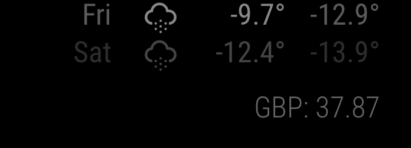

# Module: mmm-uah-currency
This is module for [MagicMirror](https://github.com/MichMich/MagicMirror) that gets todays currency rate from bank.gov.ua [API](https://bank.gov.ua/ua/open-data/api-dev) for choosen currency. 

## Installation
1. Go to MagicMirror's `modules` folder and execute `git clone https://github.com/wzooff/mmm-uah-currency.git`.
2. add module into modules array in `config.js` 
3. reboot MM service
4. profit!!!

## Configuration

````javascript
modules: [
  {
    module: 'mmm-uah-currency',
    position: "bottom_right",
    config: {
      currencyCode: "USD", // Default, so you can ommit config section.
    }
  }
]
````

## Screenshot



## TODO

* configure update scheduled by exact time, not interval
